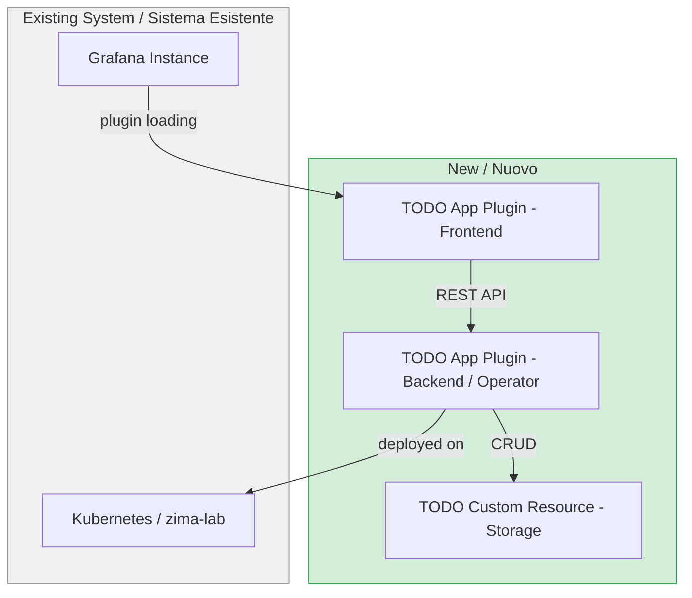
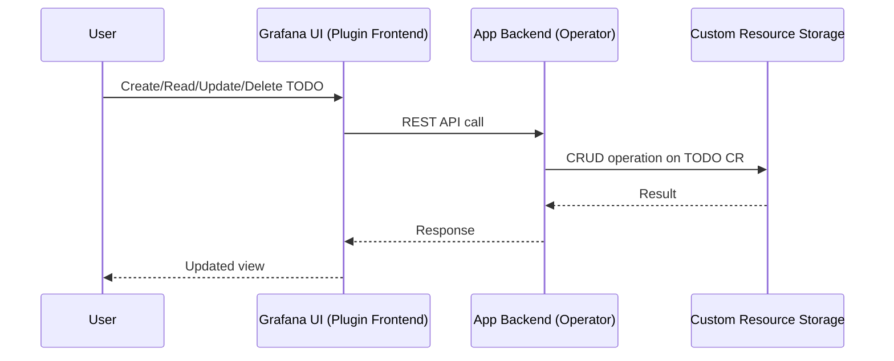

# FD-001: TODO Grafana App - grafana-app-sdk CRUD with zima-lab deploy

## Problem / Problema

Serve un'applicazione per la gestione di TODO che permetta agli utenti di creare, leggere, aggiornare e cancellare task. L'applicazione deve essere accessibile come plugin Grafana app e deployabile nell'ambiente zima-lab. Attualmente non esiste uno strumento centralizzato di gestione task integrato nella piattaforma di osservabilita' basata su Grafana.

We need a TODO management application that allows users to create, read, update, and delete TODO items. The application should be accessible as a Grafana app plugin and deployable to the zima-lab environment. Currently there is no centralized task management tool integrated into the existing Grafana-based observability platform.

## Solutions Considered / Soluzioni Considerate

### Option A: Standalone REST API con PostgreSQL / Opzione A: REST API standalone con PostgreSQL

Backend standalone (Go o Node.js) con database PostgreSQL per lo storage dei TODO, esposto come data source plugin in Grafana.

- **Pro:** Schema relazionale flessibile, query SQL potenti, indipendente da Kubernetes
- **Con / Contro:** Richiede gestione separata del database (backup, migrazioni, alta disponibilita'), non sfrutta l'ecosistema Kubernetes gia' presente in zima-lab, maggiore complessita' operativa

### Option B (chosen): grafana-app-sdk con Kubernetes CRDs / Opzione B (scelta): grafana-app-sdk con Kubernetes CRDs

Utilizzo di `grafana-app-sdk` per definire i TODO come Custom Resources Kubernetes, con un operator che gestisce il ciclo di vita CRUD. Il frontend e' un Grafana app plugin.

- **Pro:** Nativo Kubernetes (sfrutta l'infrastruttura zima-lab esistente), nessun database esterno da gestire, storage dichiarativo tramite CRD, scaffolding standardizzato via grafana-app-sdk, allineato con le best practice Grafana per app plugin
- **Con / Contro:** Dipendenza da Kubernetes (non utilizzabile senza cluster), curva di apprendimento per grafana-app-sdk, query complesse sui TODO meno immediate rispetto a SQL

**Motivazione scelta / Justification:** L'ambiente zima-lab e' gia' basato su Kubernetes, quindi usare CRD come storage elimina la necessita' di gestire un database separato. `grafana-app-sdk` fornisce lo scaffolding standard per plugin Grafana, riducendo il boilerplate e garantendo compatibilita' con le versioni future di Grafana.

## Architecture / Architettura

<!-- EN: MANDATORY — This diagram must show where this feature integrates in the existing system.
     Include: existing components (grey), new components (green), data flow, protocols.
     This is NOT optional — /fd-review will REJECT the FD without a filled diagram. -->
<!-- IT: OBBLIGATORIO — Questo diagramma deve mostrare dove si integra la feature nel sistema esistente.
     Includere: componenti esistenti (grigio), nuovi componenti (verde), flusso dati, protocolli.
     NON e' opzionale — /fd-review RIFIUTERA' il FD senza un diagramma compilato. -->

### Integration Context / Contesto di Integrazione

### Data Flow / Flusso Dati

## Interfaces / Interfacce

<!-- EN: Define interfaces between components that will become separate SDDs -->
<!-- IT: Definisci le interfacce tra i componenti che verranno generati come SDD separati -->

| Component / Componente | Input | Output | Protocol / Protocollo |
|------------------------|-------|--------|-----------------------|
| TODO Frontend Plugin (SDD-003) | User interactions (form submit, click) | `POST/GET/PUT/DELETE /apis/todo.grafana.app/v1/namespaces/{ns}/todos` | Grafana Plugin SDK, REST/JSON |
| TODO Backend / Operator (SDD-002) | REST API requests da Grafana | `TodoResource` CRUD responses `{uid, title, description, status, createdAt, updatedAt}` | grafana-app-sdk resource API |
| TODO Custom Resource (SDD-001) | CR spec: `{title: string, description: string, status: "open"\|"in_progress"\|"done"}` | Stored TODO data in etcd via K8s API | Kubernetes CRD API (`apiVersion: todo.grafana.app/v1`, `kind: Todo`) |
| Deployment (SDD-004) | Container images (operator + plugin) | Running pods, services, ingress | Kubernetes manifests / zima-lab CD pipeline |

## Planned SDDs / SDD Previsti

<!-- EN: How many SDDs will be generated from this FD? One per component/service -->
<!-- IT: Quanti SDD verranno generati da questo FD? Uno per componente/servizio -->

1. SDD-001: TODO Custom Resource definition (CRD schema, grafana-app-sdk kind)
2. SDD-002: TODO Backend / Operator (CRUD handlers, grafana-app-sdk operator logic)
3. SDD-003: TODO Frontend Plugin (Grafana app plugin UI, pages, components)
4. SDD-004: Deployment to zima-lab (Kubernetes manifests, CI/CD, Tanka/Helm config)

## Constraints / Vincoli

- Utilizzare `grafana-app-sdk` per le definizioni delle risorse e lo scaffolding dell'operator
- Deve essere deployabile nell'ambiente Kubernetes zima-lab
- Seguire le convenzioni di sviluppo plugin Grafana
- Il modello dati TODO deve essere semplice (title, description, status, timestamps)
- Nessun segreto hardcoded — usare variabili d'ambiente o secret manager Kubernetes

## Verification / Verifica

- [ ] Il CRD `Todo` (apiVersion: `todo.grafana.app/v1`) e' installabile su un cluster Kubernetes e validato dallo schema OpenAPI
- [ ] Le operazioni CRUD (create, list, get, update, delete) funzionano via REST API (`/apis/todo.grafana.app/v1/namespaces/{ns}/todos`)
- [ ] L'operator gestisce correttamente il ciclo di vita delle risorse Todo (creazione, aggiornamento, cancellazione)
- [ ] Il plugin Grafana si carica correttamente e mostra la pagina lista TODO
- [ ] Il frontend permette di creare, modificare e cancellare un TODO tramite interfaccia grafica
- [ ] Il campo `status` accetta solo i valori `open`, `in_progress`, `done`
- [ ] Il deploy su zima-lab avviene con successo tramite pipeline CD
- [ ] Nessun segreto e' hardcoded nei manifest o nel codice

## Notes / Note

<!-- Note aggiuntive, link, riferimenti -->
- Riferimento: [grafana-app-sdk documentation](https://github.com/grafana/grafana-app-sdk)
- L'ambiente zima-lab utilizza Kubernetes con accesso tramite kubeconfig gestito dal CD pipeline
