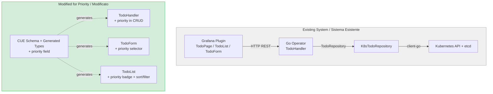
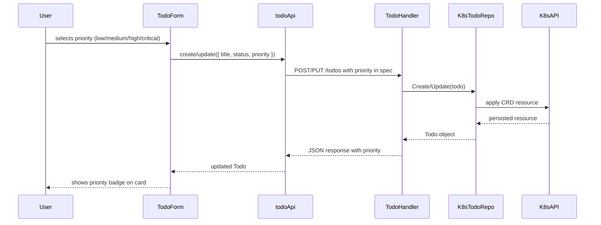

# FD-002: Add priority field to Todo

## Problem / Problema

Currently all Todo items are treated with equal importance. Users have no way to distinguish urgent tasks from low-priority ones, making it difficult to triage and focus on what matters most. When the list grows, there is no mechanism to sort or filter by urgency, forcing users to mentally track priorities outside the application.

Attualmente tutti i Todo hanno la stessa importanza. Gli utenti non possono distinguere le attivita' urgenti da quelle meno importanti, rendendo difficile stabilire le priorita' e concentrarsi su cio' che conta. Al crescere della lista, non esiste un meccanismo per ordinare o filtrare per urgenza.

## Solutions Considered / Soluzioni Considerate

### Option A: Numeric priority (1-10) / Opzione A: Priorita' numerica (1-10)

- **Pro:** Maximum flexibility, allows fine-grained ordering between items
- **Con / Contro:** Cognitive overhead — users must decide between 10 levels, leading to inconsistent usage. UI becomes cluttered with a large range. Sorting is powerful but the distinction between adjacent values (e.g., 6 vs 7) is meaningless in practice.

### Option B (chosen): Enum priority (low, medium, high, critical) / Opzione B (scelta): Enum (low, medium, high, critical)

- **Pro:** Simple mental model — 4 clearly distinct levels are easy to choose from. Maps naturally to color-coded badges in the UI. Easy to filter and sort. Aligns with the existing `status` enum pattern in the Todo schema (CUE definition).
- **Con / Contro:** Less granular than numeric — cannot express "between medium and high". However, this level of granularity is sufficient for a task management tool of this scope.

**Justification:** Option B is chosen because it follows the existing enum pattern used by `status` in the Todo CRD, keeps the UX simple, and provides sufficient granularity for task triage. The 4-level enum also maps cleanly to visual indicators (color badges) already used for status.

## Architecture / Architettura

This feature adds a new field across all layers of the existing stack. No new components are introduced — only modifications to existing ones.

### Integration Context / Contesto di Integrazione

### Data Flow / Flusso Dati

## Interfaces / Interfacce

| Component / Componente | Input | Output | Protocol / Protocollo |
|------------------------|-------|--------|-----------------------|
| CUE Schema (todo_v1.cue) | `priority: "low" \| "medium" \| "high" \| "critical"` | Generated Go + TS types | Code generation |
| TodoHandler (Go) | HTTP JSON body with `priority` field | JSON response with `priority` in spec | REST HTTP |
| TodoForm (React) | User selection from dropdown | `{ title, description?, status, priority }` | React props / state |
| TodoList (React) | Todo[] with `priority` field | Color-coded priority badge, sort/filter controls | React props |

## Planned SDDs / SDD Previsti

1. SDD-001: **Data model & persistence** — Add `priority` enum field to `todo_v1.cue` schema, regenerate Go and TypeScript types, update CRD definition. Default value: `"medium"` for backward compatibility with existing todos.
2. SDD-002: **API layer** — Update `TodoHandler` to accept and return `priority` in create/update operations. Validate that priority is one of the allowed enum values. Ensure existing todos without priority are served with default `"medium"`.
3. SDD-003: **UI components** — Add priority `Select` dropdown to `TodoForm`, add color-coded `Badge` to `TodoList` cards, add sort-by-priority and filter-by-priority controls to `TodoPage`.

## Constraints / Vincoli

- Backward compatibility: existing Todo resources in Kubernetes must remain valid. The `priority` field must be optional in the CRD with a default of `"medium"`.
- Follow existing enum pattern from `status` field (CUE schema definition, generated types).
- No new dependencies — use existing Grafana UI components (`Select`, `Badge`).
- Tests required for each SDD per constitution.

## Verification / Verifica

- [ ] A new Todo can be created with a specific priority (low, medium, high, critical)
- [ ] A Todo can be updated to change its priority
- [ ] Existing Todos without a priority field default to "medium" when read
- [ ] TodoList displays a color-coded badge for each priority level
- [ ] Todos can be sorted by priority (critical > high > medium > low)
- [ ] Todos can be filtered to show only specific priority levels
- [ ] CUE schema validates that only the 4 allowed enum values are accepted
- [ ] Go and TypeScript generated types include the priority field
- [ ] API rejects invalid priority values with an explicit error

## Notes / Note

- The 4-level enum (low, medium, high, critical) mirrors common issue tracker conventions (e.g., Jira, Linear).
- Color mapping suggestion: low=blue, medium=yellow, high=orange, critical=red.
- The `priority` field follows the same CUE enum pattern as `status: "open" | "in_progress" | "done"`.
