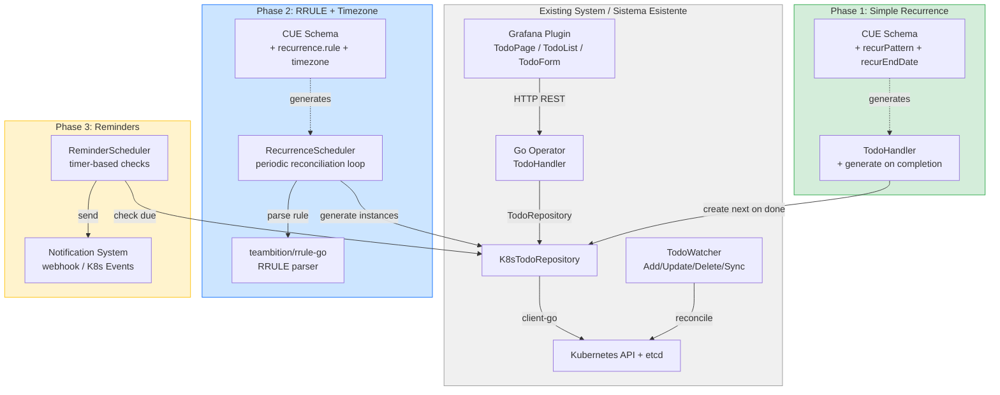
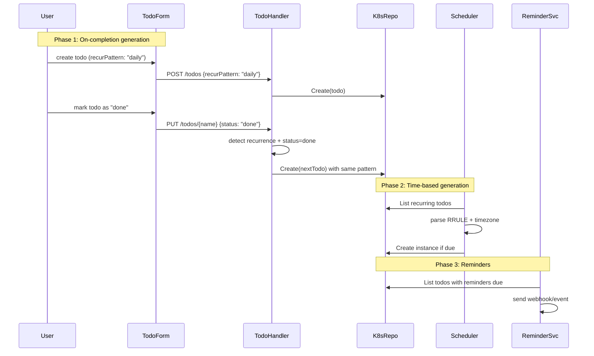

# FD-003: Recurring Todos with scheduling, reminders, and timezone support

## Problem / Problema

Users cannot create repeating tasks. Every recurring activity (daily standup, weekly report, monthly review) must be manually re-created each time. There is no way to schedule a todo for a future time, receive reminders before a deadline, or handle timezone differences between users and the server. This forces users to maintain external calendars or mental checklists alongside the Todo app, defeating its purpose as a centralized task management tool.

Gli utenti non possono creare task ricorrenti. Ogni attivita' che si ripete (standup giornaliero, report settimanale, review mensile) deve essere ricreata manualmente ogni volta. Non e' possibile programmare un todo per un orario futuro, ricevere promemoria, o gestire i fusi orari. Questo costringe gli utenti a usare calendari esterni, vanificando lo scopo dell'app come strumento centralizzato.

## Solutions Considered / Soluzioni Considerate

### Option A: Simple enum recurrence (daily/weekly/monthly) with on-completion generation

- **Pro:** Zero new infrastructure — no scheduler, no background jobs. Minimal schema changes (3 optional fields). Generation triggered on status change to "done", so no timing precision issues. Easy to implement and test.
- **Con / Contro:** No time-based scheduling (can't say "every Monday at 9 AM"). No reminders. No timezone support. User must manually complete a todo to trigger the next one. Limited to fixed patterns — no "every 2 weeks" or "last Friday of month".

### Option B: RFC 5545 RRULE with operator scheduler and reminder system

- **Pro:** Industry standard (Google Calendar, Outlook, Todoist use RRULE). Supports complex patterns ("every 3rd Friday", "weekdays only", interval-based). Per-todo timezone support via IANA identifiers. Reminder system with configurable offsets. Well-supported libraries exist (Go: teambition/rrule-go, TS: rrule.js).
- **Con / Contro:** Requires background scheduler in operator (new component). RRULE parsing complexity and DoS risk. Timezone edge cases (DST transitions, ambiguous times). Reminder delivery guarantees require careful design. Larger implementation scope.

### Option C (chosen): Phased approach — MVP with simple recurrence, then RRULE + reminders

- **Pro:** Delivers value immediately with Phase 1 (simple recurrence, ~1 week). Progressively adds complexity only when needed. Phase 1 requires zero new infrastructure. Each phase can be independently reviewed and verified via Forgia gates. Risk is contained — Phase 1 failures don't block the existing app.
- **Con / Contro:** Phase 1 has limited recurrence patterns. Users wanting complex schedules must wait for Phase 2. Three separate implementation cycles.

**Justification:** The phased approach balances immediate value (simple recurrence in Phase 1) with long-term capability (RRULE + reminders in Phases 2-3). Phase 1's "generate on completion" pattern requires zero new infrastructure and can ship quickly. Each phase is a self-contained FD that passes through Forgia review independently.

## Architecture / Architettura

This feature evolves across 3 phases, each adding a layer to the existing stack.

### Integration Context / Contesto di Integrazione

### Data Flow / Flusso Dati

## Interfaces / Interfacce

| Component / Componente | Input | Output | Protocol / Protocollo |
|------------------------|-------|--------|-----------------------|
| CUE Schema Phase 1 | `recurPattern?: "daily" \| "weekly" \| "monthly"`, `recurEndDate?: string`, `recurGenerateOnCompletion?: bool` | Generated Go + TS types | Code generation |
| CUE Schema Phase 2 | `recurrence?: {rule: string, timezone?: string, excludedDates?: [...string]}` | Generated Go + TS types with nested struct | Code generation |
| TodoHandler (Phase 1) | Status change to "done" on recurring todo | New Todo instance created with same spec | Internal (handler logic) |
| RecurrenceScheduler (Phase 2) | Periodic tick (1-5 min) | Queries recurring todos, creates instances when due | In-process goroutine |
| ReminderScheduler (Phase 3) | Periodic tick (5-30 sec) | Sends webhook/K8s Event for due reminders | HTTP webhook / K8s Events API |
| TodoForm (React) | User selects recurrence pattern + timezone | `{recurPattern, recurrence, reminders}` in spec | React props / state |

## Planned SDDs / SDD Previsti

### Phase 1: Simple Recurrence (this FD)

1. SDD-001: **Data model** — Add `recurPattern` (enum: daily/weekly/monthly), `recurEndDate` (optional ISO 8601), `recurGenerateOnCompletion` (bool, default false) to CUE schema. Regenerate Go/TS types.
2. SDD-002: **Handler logic** — On `UpdateTodo` when status changes to "done" and `recurGenerateOnCompletion` is true: create next Todo instance with same spec (status reset to "open"). Validate recurrence fields. Check `recurEndDate` before generating.
3. SDD-003: **UI components** — Add recurrence `Select` dropdown to TodoForm (None/Daily/Weekly/Monthly), optional end date input, "generate on completion" checkbox. Add "Recurring" badge to TodoList. Add filter for recurring vs one-time todos.

### Phase 2: RRULE + Timezone (separate FD-004)

4. SDD-004: Data model — Replace simple enum with `recurrence` nested struct (RRULE rule, IANA timezone, excluded dates)
5. SDD-005: RecurrenceScheduler — Background goroutine with periodic reconciliation, RRULE parsing via teambition/rrule-go
6. SDD-006: UI — RRULE builder, timezone selector, occurrence preview

### Phase 3: Reminders (separate FD-005)

7. SDD-007: Reminder schema + storage
8. SDD-008: ReminderScheduler + delivery (webhook, K8s Events)
9. SDD-009: Reminder UI + notification preferences

## Constraints / Vincoli

- **Phase 1 only** — this FD covers Phase 1. Phases 2-3 are separate FDs (FD-004, FD-005)
- Backward compatibility: `recurPattern` must be optional. Existing todos without recurrence remain valid.
- No new dependencies in Phase 1 — no RRULE library, no scheduler, no timezone library
- Single-replica operator: no distributed coordination needed for Phase 1 (generation is synchronous in handler)
- Tests required per SDD per constitution
- Max 365 generated instances per series (prevent runaway generation)
- No hardcoded secrets — follows constitution security rules

## Verification / Verifica

- [ ] A recurring todo (daily/weekly/monthly) generates a new instance when marked as "done"
- [ ] The generated instance inherits title, description, priority, and recurrence config from the parent
- [ ] The generated instance has status "open" (not "done")
- [ ] Generation stops when `recurEndDate` is reached
- [ ] Generation does NOT happen when `recurGenerateOnCompletion` is false
- [ ] Non-recurring todos (no `recurPattern`) behave exactly as before (no regression)
- [ ] TodoForm shows recurrence controls only when a pattern is selected
- [ ] TodoList shows a "Recurring" badge on recurring todos
- [ ] API rejects invalid `recurPattern` values with explicit error
- [ ] API rejects invalid `recurEndDate` format with explicit error

## Deep Analysis

> Generated by `/fd-deep` with 4 parallel exploration agents on 2026-03-15.

### Agent 1 — Algorithmic Findings

**Recurrence Standards:**
- **RFC 5545 RRULE** is the industry standard (Google Calendar, Outlook, Todoist). Supports complex patterns like "every 3rd Friday" and interval-based frequencies.
- **Cron expressions** are simpler but not calendar-aware (no "last Friday of month").
- **Recommended hybrid storage**: Store RRULE string (immutable) + denormalized `nextOccurrence` timestamp (fast queries).

**Libraries Available:**
- **Go**: `teambition/rrule-go` (full RFC 5545), `robfig/cron` (simpler cron-based)
- **TypeScript**: `rrule.js` (full RFC 5545 + natural language), `rSchedule` (TypeScript-first, date-agnostic)
- **Timezone**: Go `time.LoadLocation()` (stdlib), Luxon or date-fns-tz (frontend)

**Current codebase**: No date/time libraries beyond Go stdlib `time` package. No scheduling or cron code exists.

### Agent 2 — Structural Findings

**Integration points across 8 layers:**
1. **CUE Schema** (`kinds/todo_v1.cue`): Add recurrence fields following existing enum pattern (like `status`, `priority`)
2. **Go Types** (`pkg/generated/todo/v1/`): Auto-generated from CUE. New `SpecRecurPattern` type + constants
3. **Repository** (`pkg/repository/todo_repository.go`): Needs `ListRecurringTodos()` for Phase 2; Phase 1 uses existing CRUD
4. **Handler** (`pkg/handler/todo_handler.go`): Phase 1 generation logic lives here — detect status→done + recurrence → create next
5. **Watcher** (`pkg/watcher/todo_watcher.go`): Phase 2 scheduler hooks here. Currently only logs events.
6. **App Factory** (`pkg/app/app.go`): Phase 2 registers scheduler goroutine here
7. **Frontend** (`plugin/src/components/`): TodoForm gets recurrence controls; TodoList gets badge
8. **K8s Manifests**: CRD updated automatically from CUE codegen

**Key constraint**: K8s CRD objects have ~1MB size limit. Instances MUST be separate Todo CRDs (not stored in parent). Use labels for parent→child linking.

### Agent 3 — Incremental / MVP Findings

**Phase 1 MVP is achievable with:**
- **3 optional fields**: `recurPattern` (enum), `recurEndDate` (string), `recurGenerateOnCompletion` (bool)
- **Zero new infrastructure**: No scheduler, no timer, no external dependencies
- **Trigger**: On status change to "done" in `UpdateTodo` handler — synchronous, no race conditions
- **Files to modify**: `todo_v1.cue`, `todo_handler.go`, `TodoForm.tsx`, `TodoList.tsx` (+ generated types)
- **Estimated scope**: 3 SDDs, similar effort to FD-002 (priority field)

### Agent 4 — Risk Findings

**Top 5 Risks for Phase 1:**

| Risk | Likelihood | Impact | Mitigation |
|------|-----------|--------|------------|
| Runaway generation (infinite chain) | Medium | High | Cap at 365 instances; check `recurEndDate` before every generation |
| Status ambiguity ("done" = stop series or just this instance?) | Medium | Medium | "Done" on instance generates next; separate "disable recurrence" action |
| Orphaned instances on parent deletion | Low | Medium | Use K8s OwnerReference for cascade deletion |
| Priority inheritance confusion | Medium | Medium | Instances inherit parent priority but can be independently edited |
| Backward compatibility (existing todos without recurrence) | Low | Medium | All recurrence fields optional with defaults |

**Top 5 Risks for Phase 2-3 (future):**

| Risk | Likelihood | Impact | Mitigation |
|------|-----------|--------|------------|
| DST transition bugs | Medium | Medium | Store UTC internally, convert for display only |
| RRULE parsing DoS | Medium | High | Max COUNT=1000, timeout parser at 100ms, reject SECONDLY/MINUTELY |
| Single-replica operator downtime = missed reminders | High | High | Document "at-least-once-if-running" semantics; catch up on restart |
| Duplicate reminders on restart | High | High | Idempotent sends with `reminderId` deduplication |
| Webhook notification data leaks | High | High | HTTPS only, whitelist domains, minimal payload (title only) |

**Recommendation from risk analysis**: Split into 3 separate FDs (FD-003 Phase 1, FD-004 Phase 2, FD-005 Phase 3) so each passes independent Forgia review with its own risk profile.

### Synthesis — Recommended Approach

1. **Start with Phase 1 (this FD)**: Simple enum recurrence with on-completion generation. Zero new infra, 3 SDDs, ships fast.
2. **Phase 2 (FD-004)**: Add RRULE + timezone when users need complex patterns. Requires `teambition/rrule-go` + `rrule.js` + `RecurrenceScheduler` goroutine.
3. **Phase 3 (FD-005)**: Add reminders only after scheduling is stable. Requires careful handling of delivery guarantees and operator downtime.

This phased approach was validated by all 4 exploration agents as the lowest-risk path that delivers incremental value.

## Notes / Note

- Phase 1 follows the same implementation pattern as FD-002 (add fields to CUE schema → handler → UI), making it familiar and low-risk.
- The "generate on completion" pattern avoids all timing, scheduling, and timezone complexity in Phase 1.
- RFC 5545 RRULE references: https://icalendar.org/iCalendar-RFC-5545/3-8-5-3-recurrence-rule.html
- Go library for Phase 2: https://github.com/teambition/rrule-go
- TS library for Phase 2: https://github.com/jkbrzt/rrule
- Risk analysis recommends splitting Phases 2-3 into separate FDs (FD-004, FD-005) for independent review.
